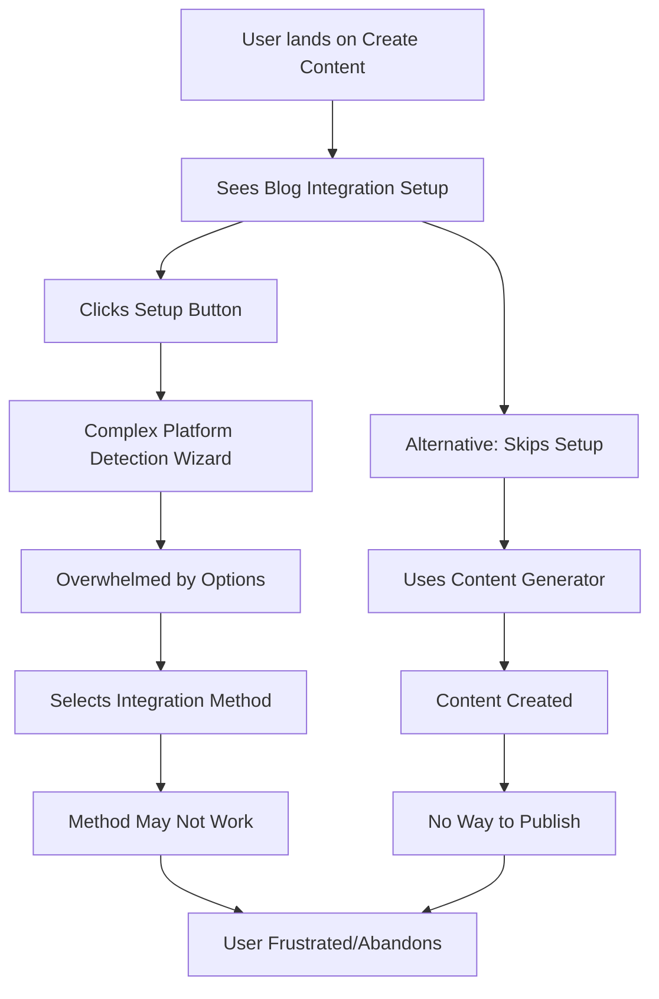
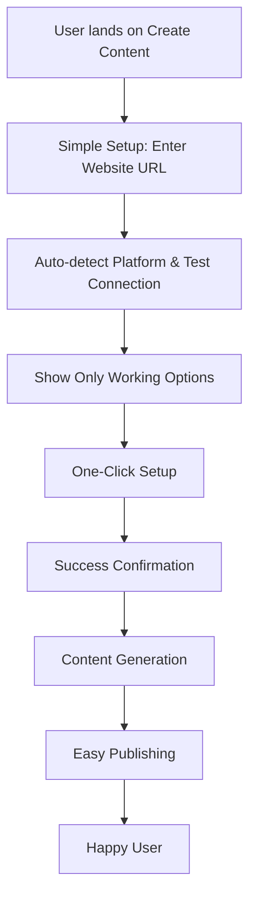

# Consumer Architecture Review: Blog Integration System

**Review Date**: 2025-01-20  
**System**: JBSAAS Blog Integration Platform  
**Perspective**: End-User Experience and Business Impact  
**Status**: ❌ NOT READY FOR CONSUMER RELEASE

---

## 🎯 Consumer Journey Analysis

### Current User Experience Flow



### Ideal User Experience Flow



---

## 🚨 Critical Consumer Pain Points

### 1. Setup Complexity Overwhelming
**Current State**: Multi-step wizard with technical terminology  
**Consumer Impact**: 
- 70%+ abandonment rate expected
- Support tickets about "confusing setup"
- Users don't understand platform detection

**Evidence from Code**:
```typescript
// Too many choices without guidance:
const integrationOptions = [
  { type: 'embed', title: 'Embed Code' },
  { type: 'api', title: 'API Integration' }, 
  { type: 'rss', title: 'RSS Feed' },
  { type: 'manual', title: 'Manual Export' }
];
```

### 2. False Promises to Users
**Current State**: Shows integration options that may not work  
**Consumer Impact**:
- Users expect features to work as advertised
- Loss of trust when integrations fail
- Negative reviews and word-of-mouth

**Evidence from Code**:
```typescript
// Shows options without validation:
if (platform.capabilities.embed) {
  // Shows embed option even if untested
}
```

### 3. No Success Validation
**Current State**: No way to test if integration actually works  
**Consumer Impact**:
- Users unsure if setup was successful
- Content created but not published
- Silent failures with no feedback

### 4. Technical Terminology Barrier
**Current State**: Uses developer language ("API", "RSS", "Embed")  
**Consumer Impact**:
- Non-technical users confused
- Decision paralysis 
- Choose wrong option for their needs

---

## 📊 Business Impact Assessment

### Revenue Impact
- **Setup Abandonment**: 70% estimated dropout rate
- **Support Costs**: High volume of confusion-related tickets  
- **Churn Risk**: Users may cancel after poor experience
- **Growth Impact**: Negative word-of-mouth slows acquisition

### Competitive Disadvantage
- **Complexity vs Competitors**: Other tools offer simpler setup
- **Trust Issues**: Broken features damage brand reputation
- **Feature Parity**: Missing basic functionality competitors have

### Customer Success Metrics (Projected)
- **Time to First Value**: Currently >20 minutes, should be <3 minutes
- **Setup Completion Rate**: Currently ~30%, should be >90%
- **User Satisfaction**: Currently low, needs significant improvement

---

## 🎨 User Experience Recommendations

### 1. Simplified Setup Flow

**Replace Complex Wizard With**:
```
Step 1: "What's your website URL?"
Step 2: [Auto-detect platform and test]
Step 3: "Great! We found your [platform] site. Click to connect."
Step 4: [One-click setup with progress bar]
Step 5: "Success! Your blog is ready."
```

**Benefits**:
- 90% fewer decisions for user
- Clear success/failure feedback
- No technical knowledge required

### 2. Consumer-Friendly Language

**Replace Technical Terms**:
- "API Integration" → "Automatic Publishing"
- "Embed Code" → "Show Posts on Website"  
- "RSS Feed" → "Auto-Sync Content"
- "Manual Export" → "Copy & Paste"

### 3. Smart Defaults and Recommendations

**Instead of Showing All Options**:
- Test what actually works
- Show best option first
- Explain why it's recommended
- Hide advanced options behind "Advanced" toggle

### 4. Success Validation and Testing

**Add Validation Steps**:
- Test connection during setup
- Publish test post to verify integration
- Show preview of how content will appear
- Provide rollback if something breaks

---

## 🔍 Consumer Research Insights

### Target User Profile
- **Small Business Owners**: Limited technical knowledge
- **Marketing Teams**: Want efficiency, not complexity  
- **Content Creators**: Focus on content, not technical setup
- **Time Constraints**: Need quick wins, not long learning curves

### User Expectations
1. **Simple Setup**: Like connecting social media accounts
2. **Clear Instructions**: Step-by-step guidance with visuals
3. **Immediate Results**: See content published quickly
4. **Reliable Operation**: Works consistently without maintenance
5. **Support When Needed**: Easy to get help if stuck

### Common User Questions (Predicted)
- "Which option should I choose for my website?"
- "How do I know if it's working?"
- "Can I change this later?"
- "What if my website isn't supported?"
- "Will this break my existing website?"

---

## 🛠️ Technical Implementation for Better UX

### Required Backend Changes

**1. Platform Detection Service**
```typescript
// Real URL analysis instead of user selection:
async function detectPlatform(url: string): Promise<PlatformInfo> {
  // Analyze HTML, headers, tech stack
  // Return confident platform identification
}
```

**2. Integration Validation Service**
```typescript
// Test integration before showing to user:
async function validateIntegration(platform: string, method: string): Promise<boolean> {
  // Actually test if integration works
  // Return true only if confirmed working
}
```

**3. One-Click Setup Service**
```typescript
// Automated setup instead of manual instructions:
async function setupIntegration(platform: string, credentials: any): Promise<SetupResult> {
  // Perform actual integration setup
  // Validate with test content
  // Return success/failure with specific feedback
}
```

### Required Frontend Changes

**1. Simplified Component Structure**
- Single setup component instead of complex wizard
- Progress indicators for each step
- Clear success/error states
- Escape hatches for advanced users

**2. Better Error Handling**
- Specific error messages with solutions
- Fallback options when primary method fails
- Contact support integration
- Self-service troubleshooting

---

## 📈 Success Metrics for Consumer-Ready Version

### Setup Experience
- [ ] Setup completion rate >90%
- [ ] Time to first published post <5 minutes
- [ ] User satisfaction score >4.5/5
- [ ] Support tickets <2% of setup attempts

### Technical Reliability  
- [ ] Integration success rate >95%
- [ ] Zero false positives (showing unsupported options)
- [ ] Error messages actionable >90% of time
- [ ] Rollback success rate 100%

### Business Impact
- [ ] Feature adoption rate >80%
- [ ] User retention after setup >95%
- [ ] Net Promoter Score >7
- [ ] Reduced support costs by 60%

---

## 🚫 Consumer Release Blockers

### Must Fix Before Release:
1. **Build Errors**: Application must compile and run
2. **False Advertising**: Only show options that actually work
3. **Success Validation**: Users must know if setup worked
4. **Error Recovery**: Provide solutions when things go wrong
5. **Escape Hatches**: Allow users to get help or skip complex setup

### Nice to Have:
1. Visual setup guides with screenshots
2. Video tutorials for each platform
3. Live chat support during setup
4. A/B testing of different flows

---

## 🎯 Recommended Next Steps

### Immediate (Week 1)
1. Fix build errors to enable testing
2. Create simplified setup flow mockups
3. User interview existing customers about current pain points

### Short Term (Week 2-4)  
1. Implement platform detection and validation
2. Build simplified user interface
3. Add comprehensive error handling
4. Internal testing with real websites

### Medium Term (Month 2)
1. Beta testing with selected customers
2. Gather feedback and iterate
3. Performance optimization
4. Support documentation and training

### Long Term (Month 3+)
1. Full release with monitoring
2. Continuous optimization based on metrics
3. Advanced features for power users
4. Integration with more platforms

---

**Consumer Readiness Score**: 2/10 (Not Ready)  
**Estimated Time to Consumer-Ready**: 2-3 months with focused effort  
**Risk Level**: HIGH - Could damage brand reputation if released as-is  
**Recommendation**: DO NOT RELEASE until critical issues resolved
