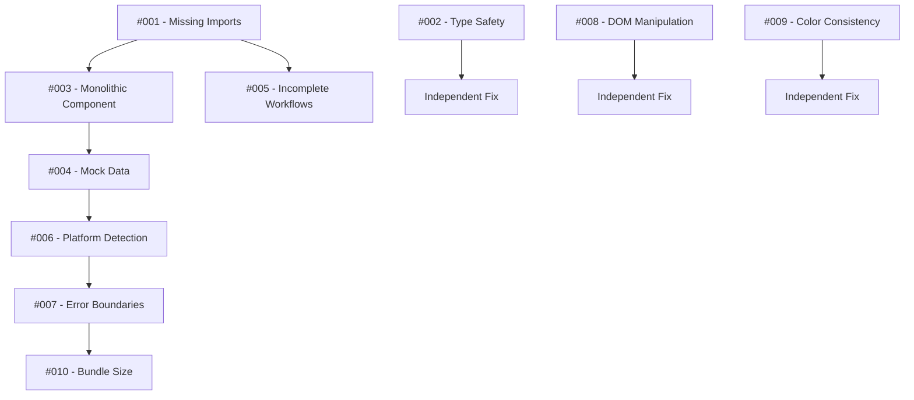

# Blog System Detailed Issue Tracker

**Purpose**: Line-by-line documentation of all issues found during audit  
**For**: Developer implementing fixes  
**Status**: Issues documented and prioritized

---

## 🚨 CRITICAL ISSUES (Build Blockers)

### Issue #001: Missing Component Imports
**File**: `src/components/blog/SmartIntegrationWizard.tsx`  
**Lines**: 7-10  
**Severity**: CRITICAL  
**Impact**: Application will not build

```typescript
// BROKEN IMPORTS:
import { ManualExportTools } from './ManualExportTools';          // ❌ FILE DOES NOT EXIST
import { PlatformInstructions } from './PlatformInstructions';    // ❌ FILE DOES NOT EXIST  
import { EmbedCodeGenerator } from './EmbedCodeGenerator';         // ❌ FILE DOES NOT EXIST
import { APIIntegrationSetup } from './APIIntegrationSetup';      // ❌ FILE DOES NOT EXIST
```

**Fix Required**: Create these 4 missing component files with basic structure
**Time Estimate**: 2-4 hours
**Dependencies**: None

### Issue #002: Type Safety Violation
**File**: `src/components/media/ImageLibrary.tsx`  
**Line**: 28  
**Severity**: HIGH  
**Impact**: Breaks TypeScript type safety

```typescript
// CURRENT (BROKEN):
dimensions: any;

// SHOULD BE:
dimensions: {
  width: number;
  height: number;
} | null;
```

**Fix Required**: Replace `any` with proper interface
**Time Estimate**: 15 minutes
**Dependencies**: None

---

## ⚠️ HIGH PRIORITY ISSUES (Architecture)

### Issue #003: Monolithic Component
**File**: `src/components/ai/AdvancedContentEngine.tsx`  
**Lines**: 1-927 (entire file)  
**Severity**: HIGH  
**Impact**: Unmaintainable code, violates SOLID principles

**Problems Identified**:
- Single component handling 4+ different responsibilities
- Template management mixed with UI rendering
- AI generation logic coupled with form handling
- No separation of concerns

**Components This Should Become**:
1. `TemplateSelector.tsx` (~100 lines)
2. `ContentForm.tsx` (~150 lines) 
3. `ContentPreview.tsx` (~100 lines)
4. `ContentGenerator.tsx` (~200 lines)
5. `data/contentTemplates.ts` (data only)

**Fix Required**: Complete refactor into focused components
**Time Estimate**: 2-3 days
**Dependencies**: Complete Issue #001 first

### Issue #004: Mock Data Throughout Application
**Files**: Multiple  
**Severity**: HIGH  
**Impact**: Not production-ready, misleads users

**Affected Components**:

1. **TrendAnalyzer.tsx** (Lines 71-152)
```typescript
// 80+ lines of hardcoded mock data:
const mockTrends: TrendData[] = [
  {
    keyword: 'AI automation tools',
    momentum: 'rising',
    volume: 25000,
    // ... more hardcoded data
  }
];
```

2. **SEOScoreCalculator.tsx** (Lines 76-87)
```typescript
// Mock SEO analysis:
const mockScore: SEOScore = {
  overall: calculateOverallScore(),
  // ... fake scoring
};
```

3. **ContentPlanner.tsx** (Lines 86-125)
```typescript
// Mock content plans:
const mockPlans: ContentPlan[] = [
  {
    id: '1',
    date: new Date(),
    title: 'AI in Small Business: Complete Guide',
    // ... more fake data
  }
];
```

**Fix Required**: Replace all mock data with real API calls
**Time Estimate**: 1-2 weeks
**Dependencies**: Create service layer first

---

## 🔧 MEDIUM PRIORITY ISSUES (Functionality)

### Issue #005: Incomplete User Workflows
**File**: `src/components/blog/SmartIntegrationWizard.tsx`  
**Lines**: 25-44  
**Severity**: MEDIUM  
**Impact**: Confusing user experience

**Problems**:
```typescript
// Incomplete state management:
const [selectedPlatform, setSelectedPlatform] = useState<string | null>(null);
const [activeTab, setActiveTab] = useState<string>('detect');
const [selectedIntegration, setSelectedIntegration] = useState<string>('');

// Missing validation, error states, loading states
// No success/failure feedback
// No integration testing
```

**Fix Required**: Add complete workflow with validation
**Time Estimate**: 1 day
**Dependencies**: Fix missing components first

### Issue #006: Platform Detection Not Validated
**File**: `src/components/blog/PlatformDetector.tsx`  
**Lines**: 14-32  
**Severity**: MEDIUM  
**Impact**: Shows integrations that may not work

```typescript
// Shows all platforms without validation:
{Object.entries(platforms).map(([key, platform]) => (
  <SelectItem key={key} value={key}>
    {platform.name}
  </SelectItem>
))}
```

**Problems**:
- No URL validation to detect actual platform
- No testing of integration capabilities
- Users may select wrong platform

**Fix Required**: Add platform detection logic and validation
**Time Estimate**: 4-6 hours
**Dependencies**: None

### Issue #007: Missing Error Boundaries
**Files**: All components  
**Severity**: MEDIUM  
**Impact**: Poor error handling, no graceful degradation

**Missing Features**:
- Try-catch blocks around async operations
- Error boundary components
- Fallback UI states
- User-friendly error messages

**Fix Required**: Add comprehensive error handling
**Time Estimate**: 1-2 days
**Dependencies**: None

---

## 🔍 LOW PRIORITY ISSUES (Polish)

### Issue #008: Direct DOM Manipulation
**File**: `src/components/media/LogoOverlayTool.tsx`  
**Lines**: 51-106  
**Severity**: LOW  
**Impact**: Not following React patterns

```typescript
// Direct canvas manipulation instead of React patterns:
const drawCanvas = () => {
  const canvas = canvasRef.current;
  const ctx = canvas.getContext('2d');
  // ... direct DOM manipulation
};
```

**Fix Required**: Use proper React patterns or justify direct manipulation
**Time Estimate**: 2-3 hours
**Dependencies**: None

### Issue #009: Inconsistent Color Usage
**File**: `src/components/analytics/TrendAnalyzer.tsx`  
**Lines**: 181-207  
**Severity**: LOW  
**Impact**: Not following design system

```typescript
// Hardcoded colors instead of design system:
return <TrendingUp className="h-4 w-4 text-green-600" />;
return <div className="h-4 w-4 bg-blue-600 rounded-full" />;
```

**Fix Required**: Use design system tokens consistently
**Time Estimate**: 1-2 hours
**Dependencies**: None

### Issue #010: Large Bundle Size
**File**: Multiple components  
**Severity**: LOW  
**Impact**: Slow loading times

**Large Components**:
- AdvancedContentEngine.tsx: 927 lines
- ContentPlanner.tsx: 771+ lines  
- SEOScoreCalculator.tsx: 575+ lines

**Fix Required**: Code splitting and lazy loading
**Time Estimate**: 1 day
**Dependencies**: Complete refactoring first

---

## 📊 Issue Priority Matrix

| Issue | Severity | Impact | Effort | Priority |
|-------|----------|--------|--------|----------|
| #001 - Missing Imports | CRITICAL | HIGH | LOW | 1 |
| #002 - Type Safety | HIGH | MEDIUM | LOW | 2 |
| #003 - Monolithic Component | HIGH | HIGH | HIGH | 3 |
| #004 - Mock Data | HIGH | HIGH | MEDIUM | 4 |
| #005 - Incomplete Workflows | MEDIUM | HIGH | MEDIUM | 5 |
| #006 - Platform Detection | MEDIUM | MEDIUM | MEDIUM | 6 |
| #007 - Error Boundaries | MEDIUM | HIGH | MEDIUM | 7 |
| #008 - DOM Manipulation | LOW | LOW | LOW | 8 |
| #009 - Color Consistency | LOW | LOW | LOW | 9 |
| #010 - Bundle Size | LOW | MEDIUM | HIGH | 10 |

---

## 🔄 Fix Dependencies



**Critical Path**: Issues #001 → #003 → #004 → #006 → #007  
**Independent**: Issues #002, #008, #009  
**Final Polish**: Issue #010

---

## ✅ Completion Checklist

### For Each Issue:
- [ ] Issue reproduced and understood
- [ ] Fix implemented and tested
- [ ] Code review completed
- [ ] No new issues introduced
- [ ] Documentation updated
- [ ] Related tests pass

### Before Closing Issue:
- [ ] Manual testing completed
- [ ] Performance impact assessed
- [ ] User experience validated
- [ ] Ready for consumer review

---

**Last Updated**: 2025-01-20  
**Next Review**: After fixing Issues #001-#002  
**Assigned Developer**: [To be assigned]
